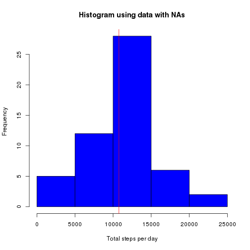
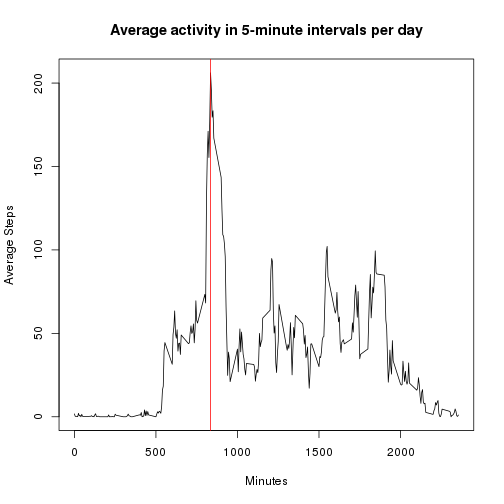
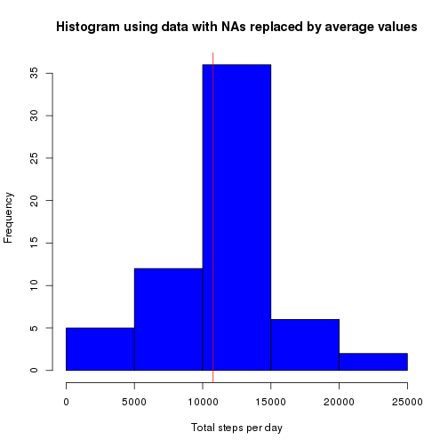
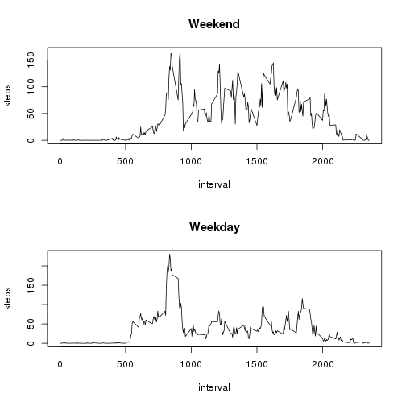

## Loading and preprocessing the data


```r
activity <- read.csv("activity.csv")
activity$date <- as.Date(activity$date)
```

## What is mean total number of steps taken per day?


```r
steps_per_day <- aggregate(steps ~ date, data = activity, sum)
mean_steps_per_day <- mean(steps_per_day$steps)
median_steps_per_day <- median(steps_per_day$steps)
hist(steps_per_day$steps,
     main = "Histogram using data with NAs",
     col = "blue",
     xlab = "Total steps per day")
abline(v=mean_steps_per_day, col="red")
```

 

The mean is 1.0766189 &times; 10<sup>4</sup> 
and median is 10765 of the total number of steps taken per day.

## What is the average daily activity pattern?


```r
average_steps <- aggregate(steps ~ interval, data = activity, mean)
max_steps <- max(average_steps$steps)
max_steps_interval <- average_steps[which(average_steps$steps == max_steps),]$interval
plot(average_steps, type="l",
     main = "Average activity in 5-minute intervals per day",
     ylab = "Average Steps",
     xlab = "Minutes")
abline(v=max_steps_interval, col="red")
```

 

The 5-minute interval, on average across all the days in the dataset, containing the maximum number of steps is 835 with 206.1698113 steps.

## Imputing missing values

Step values with missing data (NAs) have been replaced by the average value for the corresponding interval.


```r
total_nas <- sum(is.na(activity$steps))
new_dataset <- activity
for (row in seq(nrow(new_dataset))) {
  if (is.na(new_dataset[row,]$steps)) {
    new_dataset[row,]$steps <- 
      average_steps[which(average_steps$interval == 
                            new_dataset[row,]$interval),]$steps
  }
}
new_steps_per_day <- aggregate(steps ~ date, data = new_dataset, sum)
new_mean_steps_per_day <- mean(new_steps_per_day$steps)
new_median_steps_per_day <- median(new_steps_per_day$steps)
new_average_steps <- aggregate(steps ~ interval, data = new_dataset, mean)
new_max_steps <- max(new_average_steps$steps)
hist(new_steps_per_day$steps,
     main = "Histogram using data with NAs replaced by average values",
     col = "blue",
     xlab = "Total steps per day")
abline(v=new_mean_steps_per_day, col="red")
```

 

The  total number of missing values in the dataset is 2304 out of 17568 entries, or 13%.

The new mean is 1.0766189 &times; 10<sup>4</sup> steps per day (same as the original 1.0766189 &times; 10<sup>4</sup> steps) while the new median has risen a step to 1.0766189 &times; 10<sup>4</sup> steps (the same as the mean) from 10765 steps. 


The maximum number of steps has remained constant with 206.1698113 steps counted for the imputed and 206.1698113 steps for the original data, indicating there were no or few NAs in the most active days.

The days with lots of NA values will obviously have higher step counts, but the average and maximum values are unchanged. The main thing that has changed is the frequency, with the count on the vertical axis rising to 35 from 25.


## Are there differences in activity patterns between weekdays and weekends?


```r
new_dataset$daytype <- weekdays(new_dataset$date)
for (row in seq(nrow(new_dataset))) {
  if (new_dataset[row,]$daytype %in% c("Saturday", "Sunday")) {
    new_dataset[row,]$daytype <-  "weekend"
  }
  else {
    new_dataset[row,]$daytype <-  "weekday"  
  }
}
weekend_average_steps <- aggregate(steps ~ interval, 
                                   data = new_dataset[which(new_dataset$daytype == "weekend"),], 
                                   mean)
weekday_average_steps <- aggregate(steps ~ interval, 
                                   data = new_dataset[which(new_dataset$daytype == "weekday"),], 
                                   mean)
par(mfrow=c(2,1))
plot(weekend_average_steps, type="l",
     main="Weekend")
plot(weekday_average_steps, type="l",
     main="Weekday")
```

 


